### `rasec@github ~ $ ./contributions.sh`

 

### `rasec@github ~ $ whoami`

<table>
  <tr>
    <td valign="top"></td>
    <td valign="top"></td>
  </tr>
</table>

### `rasec@github ~ $ connect --professional`

